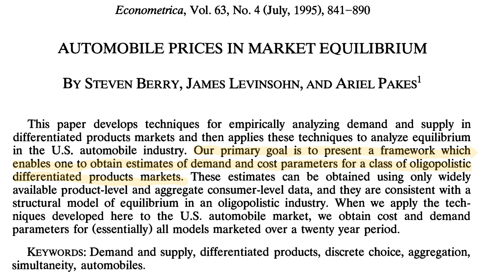
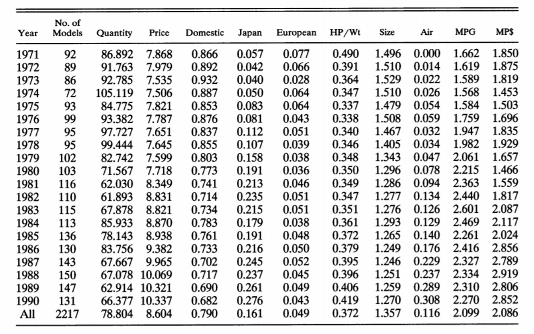
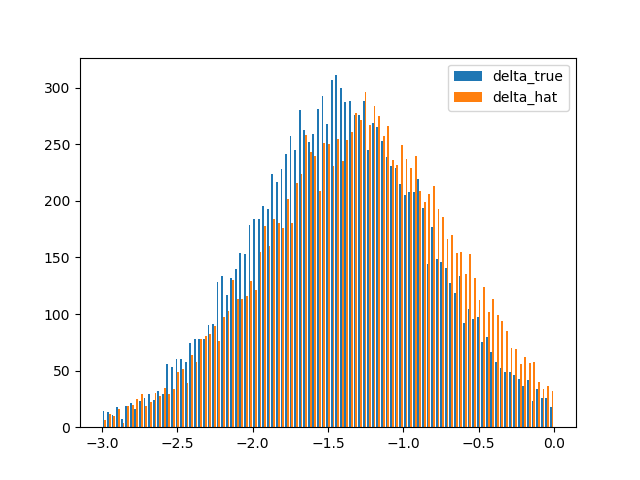
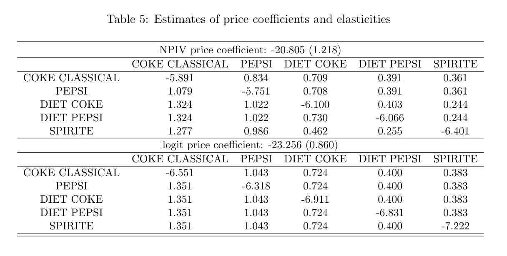
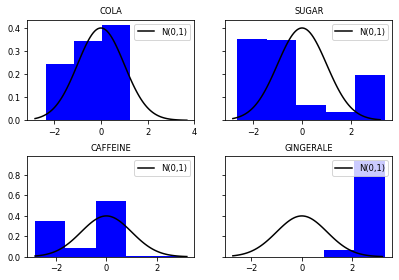
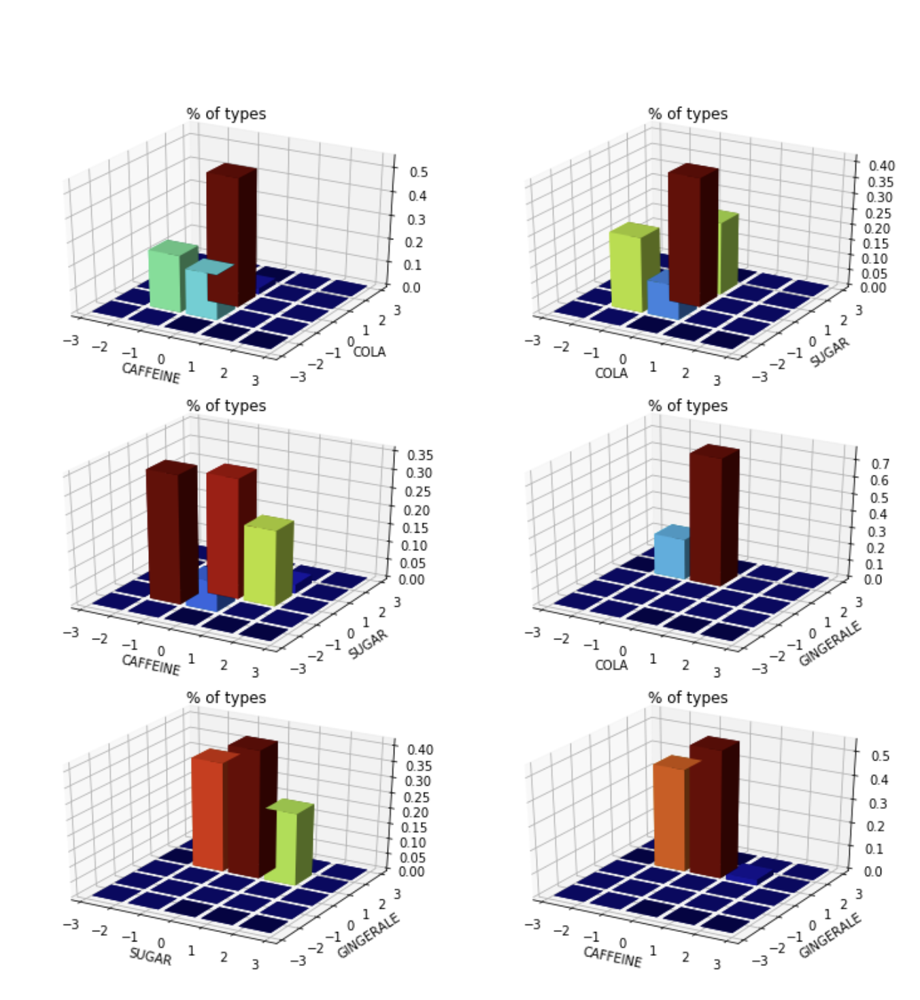

```{r setup, include=FALSE}
options(htmltools.dir.version = FALSE)
```

```{r xaringan-panelset, echo=FALSE}
xaringanExtra::use_panelset()
```

layout: true
background-image: url(images/pennlogo.png)
background-position: 0% 100%
background-size: 10%
---


# Introduction

Demand estimation for differentiated products is an ubiquitous economic and industrial problem. 

--

.pull-left[
Influential BLP (1995) empirical framework 

```{r, echo = FALSE, out.height = 225}

```
]

--

.pull-right[
The framework and technique simultaneously adresses:

- own and cross-elasticities of demand, diversion ratios, etc


- effects of a changes in product structure on demand, e.g., counterfactual prices, new product introduction, etc


- consumer welfare
]

--

Distinguish the **BLP model** and the **BLP method**
---

# Our paper 


- We provide a new estimation framework that enables *flexible specifications* **consistent with the BLP model** to be taken to data

- Existing techniques limit the flexibility of demand specifications used in practice
    - Independent normal RC's on a small number of characteristics 

- Key idea is that we "reverse" the BLP estimation idea
    - estimation of (inverse) demand (**Step 1**)
    - estimation of preferences (**Step 2**)
    - **Decoupling** => flexible specifications in each step
	  
	
- Can recover many of the quantities of interest from 1st step; 
- 2nd step recovers the distribution of preferences (and potentially improves efficiency)   	

---

# Related Literature

**Exchangeability in BLP**: 

- BLP (1995)
- Gandhi and Houde (2020)

**Linear IV Estimators and BLP**

- Compiani (2020)
- Salanie and Wolak (2019)
- Fosgerau, Monardo, de Palma (2019)

**Nonparametric identification of BLP**
- Berry, Gandhi, and Haile (2013)
- Berry and Haile (2014)
- Berry and Haile (2020)

---

# The Model

Structural model of demand based on product characteristics:

- includes endogenous characteristics: prices
- includes unobserved product characteristics: structural demand errors

--

For product $j \in J$ in market $t \in T$, let

- $x_{jt} \in \mathbb{R}^{K}$ be a vector of observed product characteristics
- $\xi_{jt} \in \mathbb{R}$ be ab *unobserved* product characteristic. 
- Stack $x_t = (x_{jt})_{j\in J}$ and $\xi_{t} = (\xi_{jt})_{j \in J}$

--

Demand function for each product $j$ in market $t$ is $$\sigma_{j} \left( x_{t}, \xi_{t} \right)$$

 
Every product's demand depends on every product's characteristics, both observed *and* unobserved

---

# Example


.pull-left[
BLP 1995 car dataset

```{r, echo = FALSE, out.height=250}

```

]

--

.pull-right[
Take $t = 1990$. 

- 131 products

- 9 measured characteristics

- Each $j = 1,\dots, 131$ has demand function $\sigma_{j}$ 


- Each $\sigma_{j}$ is a function of $$131 \times 9 = 1179 \mbox{ observed } x_{t}$$ $$+131 \mbox{ unobserved } \xi_{t}$$ 

- Repeat for each market $t = 1971, \dots, 1990.$
]

---

# Micro Heteorogeneity 

.panelset[

.panel[.panel-name[Consumers]

<br><br>
Consumers $i \in I$

Each consumer has "tastes" $\beta_{i} \in B$ distributed $F(\beta ;\theta)$.

Consumer $i$ has a *known* demand function $$s_{j}(x_t, \xi_{t}; \beta_{i})$$ conditional on $\beta_{i}$
]

.panel[.panel-name[Heterogeneity]
<br><br>
Aggregation $$\sigma_{j}\left(x_{t},\xi_{t}\right) = \int s_j\left(x_t, \xi_t; \beta_i\right)\, dF(\beta_i; \theta)$$

Flexibility of demand $\sigma_{j}$ tied directly to parameterization $\theta$ of $F$. 
]

.panel[.panel-name[Mixed Logit]


Consumer level demand functions are *logit* $$s_{j}\left(x_{t}, \xi_{t}; \beta_{i}\right) = \frac{\exp\left(x_{jt}\beta_{i} + \xi_{jt} \right)}{1+\sum_{j'=1}^{J}\exp\left(x_{j^{\prime}t}\beta_{i} + \xi_{j^{\prime}t}\right)}$$

Market level demand is *mixed logit*

$$\sigma_{j}\left(x_{t}, \xi_{t} \right) =\int\frac{\exp\left(x_{jt}\beta_{i} + \xi_{jt} \right)}{1+\sum_{j'=1}^{J}\exp\left(x_{j^{\prime}t}\beta_{i} + \xi_{j^{\prime}t}\right)}dF(\beta_{i}; \theta)$$
When $F$ is degenerate, market demand is logit. 
]
]
---

layout: true

# But isn't this *just* a mixtures problem?

---

---

## Yes, but....

---

$$\sigma_{j}\left(x_{t}, \xi_{t} \right) =\int\frac{\exp\left(x_{jt}\beta_{i} + \xi_{jt} \right)}{1+\sum_{j'=1}^{J}\exp\left(x_{j^{\prime}t}\beta_{i} + \xi_{j^{\prime}t}\right)}dF(\beta_{i}; \theta)$$

---

$$\sigma_{j}\left(x_{t}, \color{red}{\xi_{t}} \right) =\int\frac{\exp\left(x_{jt}\beta_{i} + \color{red}{\xi_{jt}}\right)}{1+\sum_{j'=1}^{J}\exp\left(x_{j^{\prime}t}\beta_{i} + \color{red}{\xi_{j^{\prime}t}}\right)}dF(\beta_{i}; \theta)$$
---

$$\require{cancel} \sigma_{j}\left(x_{t}, \color{red}{\cancel{\xi_{t}}} \right) =\int\frac{\exp\left(x_{jt}\beta_{i} + \color{red}{\cancel{\xi_{jt}}}\right)}{1+\sum_{j'=1}^{J}\exp\left(x_{j^{\prime}t}\beta_{i} + \color{red}{\cancel{\xi_{j^{\prime}t}}}\right)}dF(\beta_{i}; \theta)$$
---

$$\require{cancel} \sigma_{j}\left(x_{t}, \color{red}{\cancel{\xi_{t}}} \right) =\int\frac{\exp\left(x_{jt}\beta_{i} + \color{red}{\cancel{\xi_{jt}}}\right)}{1+\sum_{j'=1}^{J}\exp\left(x_{j^{\prime}t}\beta_{i} + \color{red}{\cancel{\xi_{j^{\prime}t}}}\right)}dF(\beta_{i}; \theta)$$
<center>
<big><big><big><big><span>&#8615;</span></big></big></big></big>
</center>

$$\require{cancel} \sigma_{j}\left(x_{t}\right) =\int\frac{\exp\left(x_{jt}\beta_{i}  \right)}{1+\sum_{j'=1}^{J}\exp\left(x_{j^{\prime}t}\beta_{i} \right)}dF(\beta_{i}; \theta)$$
---

$$\require{cancel} \sigma_{j}\left(x_{t}, \color{red}{\cancel{\xi_{t}}} \right) =\int\frac{\exp\left(x_{jt}\beta_{i} + \color{red}{\cancel{\xi_{jt}}}\right)}{1+\sum_{j'=1}^{J}\exp\left(x_{j^{\prime}t}\beta_{i} + \color{red}{\cancel{\xi_{j^{\prime}t}}}\right)}dF(\beta_{i}; \theta)$$
<center>
<big><big><big><big><span>&#8615;</span></big></big></big></big>
</center>

$$\require{cancel} \underbrace{\sigma_{j}\left(x_{t}\right)}_{Data} =\int\underbrace{\frac{\exp\left(x_{jt}\beta_{i}  \right)}{1+\sum_{j'=1}^{J}\exp\left(x_{j^{\prime}t}\beta_{i} \right)}}_{Kernel}\underbrace{dF(\beta_{i}; \theta)}_{unknown}$$
---
$$\require{cancel} \sigma_{j}\left(x_{t}, \color{red}{\cancel{\xi_{t}}} \right) =\int\frac{\exp\left(x_{jt}\beta_{i} + \color{red}{\cancel{\xi_{jt}}}\right)}{1+\sum_{j'=1}^{J}\exp\left(x_{j^{\prime}t}\beta_{i} + \color{red}{\cancel{\xi_{j^{\prime}t}}}\right)}dF(\beta_{i}; \theta)$$

<center>
<big><big><big><big><span>&#8615;</span></big></big></big></big>
</center>

$$\require{cancel} \underbrace{\sigma_{j}\left(x_{t}\right)}_{Data} =\int\underbrace{\frac{\exp\left(x_{jt}\beta_{i}  \right)}{1+\sum_{j'=1}^{J}\exp\left(x_{j^{\prime}t}\beta_{i} \right)}}_{Kernel}\underbrace{dF(\beta_{i}; \theta)}_{unknown}$$
<center>
<big><big><big><big><span>&#8615;</span></big></big></big></big>
</center>


.center[
<font color = "blue">
observed demand = predicted demand
</font>
]

--
.center[
$F$ identified and flexibly estimatable with $x_{t}$ variation.
]

--

.center[
e.g., Fox and Gandhi (2016), Fox et al (2012)...
]
---
$$\underbrace{\sigma_{j}\left(x_{t}, \color{red}{\xi_{t}} \right)}_{Demand} =\int\underbrace{\frac{\exp\left(x_{jt}\beta_{i} + \color{red}{\xi_{jt}}\right)}{1+\sum_{j'=1}^{J}\exp\left(x_{j^{\prime}t}\beta_{i} + \color{red}{\xi_{j^{\prime}t}}\right)}}_{Kernel}\underbrace{dF(\beta_{i}; \theta)}_{Unknown}$$
<center>
<big><big><big><big><span>&#8613;</span></big></big></big></big>
</center>

$$\require{cancel} \underbrace{\sigma_{j}\left(x_{t}\right)}_{Data} =\int\underbrace{\frac{\exp\left(x_{jt}\beta_{i}  \right)}{1+\sum_{j'=1}^{J}\exp\left(x_{j^{\prime}t}\beta_{i} \right)}}_{Kernel}\underbrace{dF(\beta_{i}; \theta)}_{unknown}$$

--


If we can condition on $\color{red}{\xi_t}$, the flexible estimation can be approached as a standard mixtures problem. 

--

Equivalent to measuring *demand*.


---
layout: false
# Specifying Demand
.panelset[

.panel[.panel-name[Setup]

<br>


Transform market shares  $$s_{jt} \mapsto \ln\left(\frac{s_{jt}}{s_{0t}}\right)$$

<br>

Denote $$\beta^{0} = E[\beta_{i}]$$ <br> which completely characterizes $\theta = \theta^{logit}$ for the distribution $F(\beta_{i} ; \theta)$


]


.panel[.panel-name[General Approach]

<br><br>

Can express WLOG $$\ln\left(\frac{s_{jt}}{s_{0t}}\right) = \beta^{0} x_{jt} + \Delta_{j}(s_{t}, x_{t}) + \xi_{jt}$$ <br> <br>
where $$\Delta_{j}\left(s_t, x_t\right) = \sigma^{-1}(s_t, x_{t}; \theta^{0}) - \sigma^{-1}(s_t, x_{t}; \theta^{logit})$$ <br> is the *quality gap* (see **Gandhi and Houde** 2020)


]

.panel[.panel-name[Nested Logit Example]

<br><br>
Berry (1994): $$\ln \left(\frac{s_{jt}}{s_{0t}}\right) = \beta^{0}x_{jt} + \underbrace{\sigma\ln \left(\frac{s_{jt}}{s_{gt}}\right)}_{\color{red}{\Delta_{j}(s_{t}, x_{t})}} + \xi_{jt}$$

for

- $g=1,\dots,G$ denotes groups that partition $J$.

- $s_{gt}$  denotes group market share 
]

.panel[.panel-name[Curse of Dimensionality]


**[Gandhi and Houde 2020]**: Associate each product $j$ with a state vector $\omega_{jt}$ where

$$\omega_{jt}=\left(\omega'_{j,1,t},\dots,\omega'_{j,j-1,t},\omega'_{j,j+1,t},\dots,\omega'_{j,J,t}\right)$$
and
- $\omega_{j,j^{\prime},t}=\left(s_{j^{\prime},t},d_{j,j',t}\right) \quad j \neq j'$
- $d_{j,j',t}=\left(x_{2,jt}-x_{2,j't}\right)$

Then $$\Delta_{j}\left(x_t, s_t\right) = \Delta(\omega)$$ is exchangeable in $\omega$. 

]
]
---

# Estimation Strategy

.panelset[


.panel[.panel-name[Estimating Equation]
<br>
The structural equation is $$\log\left(\frac{s_{jt}}{s_{0t}}\right) = x_{jt}'\beta^{0} + \Delta(\omega_{jt}) + \xi_{jt}$$
<br> Approximation by basis functions $$\Delta\left(\omega_{jt}\right) \approx \sum_{\ell=1}^{L} \gamma_{\ell}^{0} \psi_{\ell}\left(\omega_{jt}\right)$$
Or more generally $$\Delta\left(\omega_{jt}\right) \approx \sum_{p=1}^{P} \alpha_{p}\phi_{p}\left(\psi(\omega_{jt}); \gamma_{p}^{0}\right) \,\, \mbox{for} \,\, \psi = (\psi_1, \dots, \psi_L)$$

]


.panel[.panel-name[IV]

IV estimator $$E\left[\log\left(\frac{s_{jt}}{s_{0t}}\right) \middle| z_{jt} \right] = E\left[x_{jt}| z_{jt}\right]'\beta^{0}+\sum_{\ell=1}^{L}E\left[\psi_{\ell}(\omega_{jt})| z_{jt}\right]'\gamma_{\ell}^{0}$$


- Implementation is a simple 2SLS. 

- Apply Gandhi-Houde instruments to build $z_{t}$ for market share terms and standard price instruments

- Can use recent ML approaches for approximating optimal IV construction (see e.g., XXX), e.g., **MLIV's, cross-fitting, etc**, to automate building IV's for multiple endogenous regressors. 

]


.panel[.panel-name[Basis Functions]

Express WLOG $$\Delta(\omega_{jt})=g(EDF(\omega_{jt}))$$ where EDF is the empirical distribution function.

- Write $F_{jt}=EDF(\omega_{jt})$

- Then we can $$\Delta(\omega_{jt})\approx f(m_{1}(F_{jt}),\dots,m_{L}(F_{jt}))$$.

- Two key elements:
    - Construct moments $m_{1}(F_{jt}),\dots,m_{L}(F_{jt})$,
    - Construct predictive function $f(\cdot)$.
]

]
---

# What have we learned?

<br><br><br>

- Estimation gives $\beta^{0}$ and $\Delta(s_t,x_t)$

- Allows us to recover $$\xi_{jt} = \ln\left( \frac{s_{jt}}{s_{0t}}\right) - \beta^{0}x_{jt} - \Delta(s_t, x_t)$$ 

- We also recover *inverse demand* $$\xi_{jt} = \sigma^{-1}(s_t,x_t)$$

- Can be used to construct price elasticities, diversion ratios, etc without explicit estimation of preference heterogeneity.

---

# From Demand to Preferences

.panelset[

.panel[.panel-name[Back to Mixtures]

Control for $$\delta_{jt}=\log\left(\frac{s_{jt}}{s_{0t}}\right) - \Delta({\omega_{jt})}$$

Recover demand $$s_{jt} = s_{j}\left(\delta_{t}, x_{t}\right)$$

Solve integral equation, e.g., minimize objective function $$Q(f) = \sum_{t=1}^{T} \sum_{j=1}^{J} \left( s_{jt} - \int \hat{s}_{j}(\delta_{t}, x_{t};\nu_{it}) f(\nu_{it})d\nu_{it} \right)^{2}$$
		
for $\hat{s}_{j}(\delta_{t}, x_{t};\nu_{it}) = \frac{\exp(\hat{\delta}_{jt}+x'_{jt}\nu_{it})}{1+\sum_{j=1}^{J}\exp\left(\hat{\delta}_{jt}+x'_{jt}\nu_{it}\right)}$.

]


.panel[.panel-name[A linear approach: FKRB]

Fox, Kim, Ryan, and Bajari (2011) approach mixed logit estimation (without $\xi_{jt}$) constrained least squares problem

Objective function becomes $$Q_{FKRB}(\theta) \approx \sum_{t=1}^{T} \sum_{j=1}^{J} \left( s_{jt} - \sum_{r=1}^{R} \theta^{r} \hat{s}_{j}(\delta_{t}, x_{t},\nu^r) \right)^{2}$$
<br>
- $\theta$ must lie on the unit simplex $\Rightarrow$ Constrained LS problem, unique global optimum is guaranteed
- Computationally fast 
]

.panel[.panel-name[Grid Points]

Picking a grid:
- Equispaced grid
- Random grid (uniform draws, Halton and Weyl sequences, etc.)
- A grid should be dense enough to ensure consistency

Performance:

- FKRB recommend to use equispaced grids in small samples
- Our simulations confirm that: FKRB estimates are based on equispaced grid and robust.
]
]

---

# Monte Carlo

.panelset[

.panel[.panel-name[Design]

Random coefficients follow a mixture of correlated normal distributions, $\beta_{i} = \frac{1}{3}\sum_{s=1}^{3}\zeta_{s}$:

$$\begin{array}{c}{\zeta_{1}}\end{array} \sim \mathcal{N}\left(\left[\begin{array}{c}{7} \\ {4} \\ {7} \\ {4}\end{array}\right],\left[\begin{array}{cccc}{1} & {0.35} & {0.35} & {0.35} \\ {0.35} & {1} & {0.35} & {0.35} \\ {0.35} & {0.35} & {1} & {0.35} \\ {0.35} & {0.35} & {0.35} & {1} \end{array}\right]\right)$$

$$\begin{array}{c}{\zeta_{2}}\end{array} \sim \mathcal{N}\left(\left[\begin{array}{c}{-9} \\ {5} \\ {-9} \\ {5}\end{array}\right],\left[\begin{array}{cccc}{3.6} & {1.4} & {1.4} & {1.4} \\ {1.4} & {3.6} & {1.4} & {1.4} \\ {1.4} & {1.4} & {1.8} & {1.4} \\ {1.4} & {1.4} & {1.4} & {1.8} \end{array}\right]\right)$$

$$\begin{array}{c}{\zeta_{3}}\end{array} \sim \mathcal{N}\left(\left[\begin{array}{c}{2} \\ {-9} \\ {2} \\ {-9}\end{array}\right],\left[\begin{array}{cccc}{1.8} & {0.2} & {0.2} & {0.2} \\ {0.2} & {1.8} & {0.2} & {0.2} \\ {0.2} & {0.2} & {3.6} & {0.2} \\ {0.2} & {0.2} & {0.2} & {3.6} \end{array}\right]\right)$$


]

.panel[.panel-name[Elasticities]
.pull-left[
<table>
<thead>
<tr class="header">
<th style="text-align: center;"></th>
<th style="text-align: center;">NPIV+IFT</th>
<th style="text-align: center;">NPIV+FKRB</th>
</tr>
</thead>
<tbody>
<tr class="odd">
<td style="text-align: center;" colspan="5">T = 200, J = 20</td>
</tr>
<tr class="even">
<td style="text-align: center;" colspan="5">Own Price</td>
</tr>
<tr class="odd">
<td style="text-align: center;">Bias</td>
<td style="text-align: center;">0.178</td>
<td style="text-align: center;">0.228</td>
</tr>
<tr class="even">
<td style="text-align: center;">RMSE</td>
<td style="text-align: center;">0.213</td>
<td style="text-align: center;">0.414</td>
</tr>
<tr class="odd">
<td style="text-align: center;" colspan="5">Cross Price</td>
</tr>
<tr class="even">
<td style="text-align: center;">Bias</td>
<td style="text-align: center;">-0.052</td>
<td style="text-align: center;">-0.0119</td>
</tr>
<tr class="odd">
<td style="text-align: center;">RMSE</td>
<td style="text-align: center;">0.105</td>
<td style="text-align: center;">0.056</td>
</tr>
</tbody>
</table>
]

.pull-right[

<table>
<thead>
<tr class="header">
<th style="text-align: center;"></th>
<th style="text-align: center;">NPIV+IFT</th>
<th style="text-align: center;">NPIV+FKRB</th>
</tr>
</thead>
<tbody>
<tr class="odd">
<td style="text-align: center;" colspan="5">T = 700, J = 20</td>
</tr>
<tr class="odd">
<td style="text-align: center;" colspan="5">Own Price</td>
</tr>
<tr class="even">
<td style="text-align: center;">Bias</td>
<td style="text-align: center;">0.0260</td>
<td style="text-align: center;">0.118</td>
</tr>
<tr class="odd">
<td style="text-align: center;">RMSE</td>
<td style="text-align: center;">0.113</td>
<td style="text-align: center;">0.338</td>
</tr>
<tr class="even">
<td style="text-align: center;" colspan="5">Cross Price</td>
</tr>
<tr class="odd">
<td style="text-align: center;">Bias</td>
<td style="text-align: center;">-0.049</td>
<td style="text-align: center;">-0.005</td>
</tr>
<tr class="even">
<td style="text-align: center;">RMSE</td>
<td style="text-align: center;">0.102</td>
<td style="text-align: center;">0.047</td>
</tr>
</tbody>
</table>

]
]

 .panel[.panel-name[Distribution]
 
 .pull-left[Unobservable <br>
 
 ]
 
 .pull-right[Random Coefficient 
 <br>
```{r, echo=FALSE, out.height=290}
knitr::include_graphics("images/bivar_T700_J20_4.png")
```

 ]
 ]
]

---

# Application to Soda Data

.panelset[

.panel[.panel-name[IRI Data]

<br><br>

- IRI academic data set: 11 years of weekly store data (2001-2011) for chain grocery and drug stores in 50 designated market areas (DMAs). 

- US soda market in 2003: National level soda sales and treat each week as market (52 markets). 

- We pick top 30 sub-brands with the largest sales across the whole time span and treat other sub-brands as an outside option.

- Sodas can be sold either in bottles or cans: focus here only on cans and aggregate across different package sizes.
]

.panel[.panel-name[Product Characteristics]

<br><br>

Specification $$u_{ijt}=-\alpha_{0}p_{jt}+x_{1,jt}^{\top}\beta^{0}+\xi_{jt}+b_{t}+x_{2,jt}^{\top}\nu_{i}+\epsilon_{ijt}$$

- $x_{1,jt} =$ "Sugar", "Caffeine", "Lemonade", "Cola", "Fruit, "Ginger Ale", "Pepper" and "Root Beer"
- $x_{2,jt} =$ "Sugar", "Caffeine", "Cola" and "Ginger Ale"
- $b_{t}$ is brand fixed effects. 

We use FKRB estimator in the second stage nd set the number of grids in each direction to be 5 so the total number of grid points is 625. 
]

.panel[.panel-name[Results]


```{r, echo=FALSE}

```

]

.panel[.panel-name[Heterogeneity]

.pull-left[]

.pull-right[]
]


]


---
# Extension: Feature Selection

<br><br>
Recall that the first-stage IV regression model is $$\log(s_{jt}/s_{0t}) \approx x'_{jt}\beta_{0}+\psi^{L}(\omega_{jt})'\gamma_{0}+\xi_{jt},$$
where $\omega_{jt}=\left(s_{jt},d_{jt}\right)$.
<br>
The number of coefficients increases exponentially for the nonlinear terms with r.c.'s:
- $dim(x_{2}+1)=8$, $L=2$, then $(L+1)^{dim(x)+1}=6561$
- $dim(x_{2}+1)=9$, $L=2$, then $(L+1)^{dim(x)+1}=19683$
- $dim(x_{2}+1)=10$, $L=2$, then $(L+1)^{dim(x)+1}=59049$

--

Feature engineering on demand (Lasso, Neural Nets, etc) with text/image/voice data

---

# Final Comments

<br><br>
- Approach opens up a new playbook for estimating demand in a flexible way

- Compatible with applications of variety of machine learning methods for instrumental variable selection and regularization

- Fast and scaleable - estimating demand across many categories as opposed to one at a time. 


